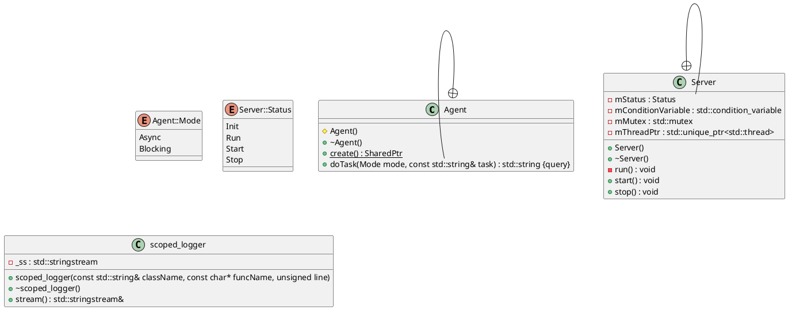

# Cmder

This will be an async task executor

Details later.

# Build
This is a small project. Visual Studio Code's task.json will be used to build the project.

## Windows
Install MSYS2. Follow https://code.visualstudio.com/docs/cpp/config-mingw to setup the developer environment.

## Linux
...

