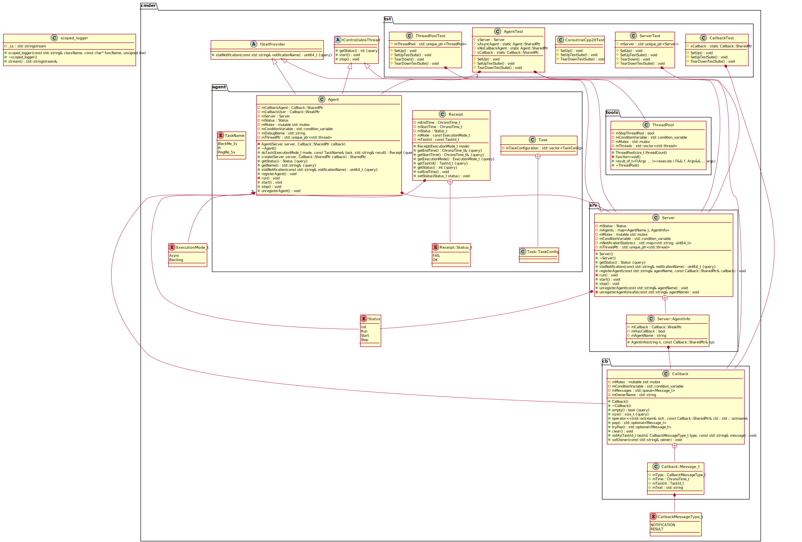

# Cmder

Async/sync task executor implementation: user will be able to create an **agent** and ask it to execute a **task** (do some calculation, anything). The **agent** checks the availability and capability of the **servers** in a pool, and selects the best one for the execution.

There are three layers involved:
* User level
* Agent level
* Server level
The communication way between the layers are done either in **synchronous** (blocking the caller) or in **asynchronous** way (don't block the result will be submitted later once it is available).

... More details later.

## Threadpool

... More details later.

## C++20 coroutines

... More details later.

# Build & IDE

Extensions used:
- Auto Header Plus v1.3.0 (Auto add header to a new file or existing file)
- C/C++ v1.16.3 (C/C++ IntelliSense, debugging, and code browsing)
- C/C++ Build Task v0.0.1 (Visual Studio Code task provider for compiling C/C++ project)
- C/C++ Extension Pack v1.3.0 (Popular extensions for C++ development in Visual Studio Code)
- C/C++ Include Guard v1.7.1 (Insert C/C++ Include Guard)
- C/C++ Themes v2.0.0 (UI Themes for C/C++ extension)
- ~~CMake v0.0.17 (CMake langage support for Visual Studio Code)~~ (FUTURE MUSIC)
- ~~CMake Tools v1.14.34 (Extended CMake support in Visual Studio Code)~~  (FUTURE MUSIC)
- Dev Containers v0.299.0 (Open any folder or repository inside a Docker container)
- Docker v1.26.0 (Makes it easy to create, manage, and debug containerized applications)
- Git History v0.6.20 (View git log, file history, compare branches or commits)
- Markdown Preview Github Styling v2.0.2 (Changes VS Code's built-in markdown preview to match Github's style)
- PlantUML v2.17.5 (Rich PlantUML support for Visual Studio Code)
- Svg Preview v2.8.3 (Preview for Svg files)

This is a small project. ~~Visual Studio Code's tasks.json will be used to build the project.~~ The VS Code's tasks.json will be kept updated that can be used to build the project on Windows. The build with MSYS2 takes minutes, a more efficient build system (caching) is required. A Dockerfile is provided that will use a lightweight Debian distribution with bazel to build the project.

## Windows
Install MSYS2. Follow https://code.visualstudio.com/docs/cpp/config-mingw to setup the developer environment. Pay attention to the tasks.json pathes and the installation folder of the mingw binaries.


## Running Debian in a Docker container

The __Dockerfile__ is used to set up a linux developer environment for the project. Install docker package on Linux or Docker Desktop on Windows Docker Desktop that enables you to build and share containerized applications and microservices. Run the commands to get the image and start a container of it:

```console
$ docker build -t  IMAGENAME .
```

```console
$ docker run -d -p 2222:22 --security-opt seccomp:unconfined -v .:/source --name IMAGENAME
```

### Dockerfile

Base image: __Debian__ (bookworm)

Packages:
* g++, gdb, build-essentials
* git
* openssh-server
* wget

Additional binaries:
- Bazelisk 1.17 copied into /usr/local/bin/bazel

The content of the __Cmder__ project mapped into the /source folder (-v .:/source).

## Bazel

The __Dockerfile__ downloads and installs the __bazelisk__ to the Debian image. The bazel build environment is defined by the configuration files checked in the GIT repository.

* __.bazelversion__: the bazel version to use
* __WORKSPACE.bazel__: the artifacts that are added to the build process
* __BUILD.bazel__: the build targets

Get the bazel version (downloads from Google Cloud if missing):
```console
$ bazel --version
```

Build everything:
```console
$ bazel build //...
```


# Design

## Class diagram

Using hpp2plantuml. Installation:

**$ pip install hpp2plantuml**

Generate PlantUML:

**$ hpp2plantuml -i "*.hpp" -i ".\tests\*.hpp" -o .\diagrams\classdiagram.puml**




## Sequence diagrams

There are three basically different setups between the user and the agent:
* **Blocking the user's call with an active callback channel**: The caller thread is blocked and released once the result is to deliver. The notification channel is active the server's notifications are forwarded to the clients.
* **Blocking the user's call with an active callback channel**: The same as above, but the notifications are not forwarded to the client.
* **Async response**: In this case it is a MUST to have a callback registered. The caller thread returns immediately to the client, the only way to pass back the result is the callback's notification channel.

### Blocking the client's call with active notification channel


### Blocking the client's call without callback


### Async command execution
...